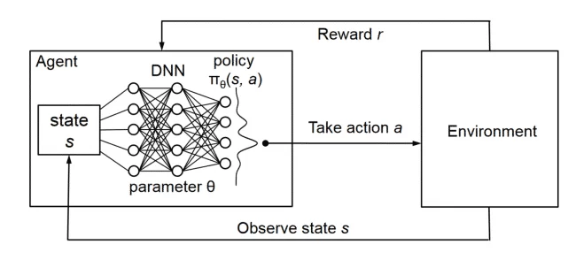
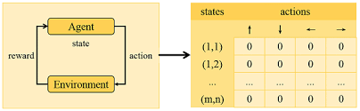

  
   

# Reinforcement Learning Demo

This repository contains three reinforcement learning mini-projects, each utilizing a different method of reinforcement learning (RL) and solving distinct OpenAI Gym environments.

## Projects Overview

1. **Tabular Q-learning**
   - **Environment:** Blackjack
   - **Description:** Implementing Q-learning with a tabular approach to solve the classic Blackjack game.

2. **Deep Q-Network (DQN)**
   - **Environment:** Frozen Lake
   - **Description:** Using Deep Q-Networks (DQN) to tackle the Frozen Lake environment, a simple grid world where an agent must navigate through frozen terrain to reach a goal.

3. **Proximal Policy Optimization (PPO)**
   - **Environment:** Bipedal Walker
   - **Description:** Applying Proximal Policy Optimization (PPO) to train an agent to control a bipedal walker, balancing and navigating through a challenging environment.

